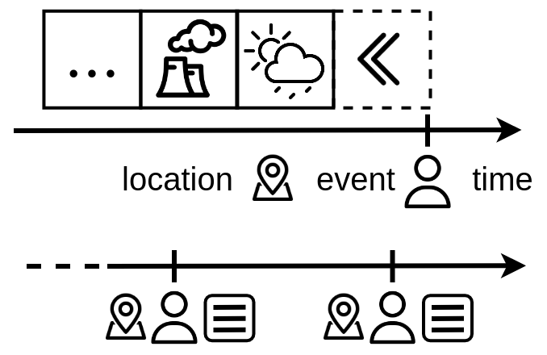

# serdif-api
An API Wrapper to the [https://serdif-example.adaptcentre.ie/](https://serdif-example.adaptcentre.ie/).

The goal of this wrapper is to facilitate the query process when associating environmental data
with individual events through location and time, irrespective of the data set. 

The data set only requires location and time for each event.

## How to use serdif-api

### Environmental data sources for version 20211012T120000 in IE

Albert Navarro-Gallinad. (2021). Weather and Air Quality data for Ireland as RDF data cube (20211012T120000) [Data set]. Zenodo. https://doi.org/10.5281/zenodo.5668287

### Data Provenance
* Weather: [MetÉireann (met)](https://www.met.ie/climate/available-data/historical-data)
* Air pollution: [European Environmental Agency (eea)](https://discomap.eea.europa.eu/map/fme/AirQualityExport.htm)
* Data Period: 2000-2021
* Country: Republic of Ireland (IE)

### Data Lineage
* The activity describes a SPARQL query to associate environmental data 
to particular health events by reasoning over location and time. 
* The GeoSPARQL function geof:sfWithin is used to select environmental data within the region 
of each event, and xsd:duration to filter a specific time window prior to the event. 
* Example fields:
  * region WEXFORD
  * time window with a duration of 4 DAYS lagged 5 DAYS from the event 

### 1. Download serdif-api github repo
[Download zip](https://github.com/navarral/serdif-api/archive/refs/heads/main.zip)
or Clone the repo with `git clone https://github.com/navarral/serdif-api.git`

### 2. Write a CSV file with the following structure:
Environmental data will be queried within a region and from a time window (period) 
prior to individual events as in the diagram before

In order to match environmental data with individual events region and dates need to be real.

Therefore, we need to define the following parameters for each event 
with the same column headers that are case-sensitive:
* **event**: event ID or name (unique string)
* **country**: standard two letter abbreviation for the country where the event happened (string)
* **region**: region(s) within the country (space separated string)
* **evDateT**: date of the event in a date time format (YYYY-MM-DDThh:mm:ssTZD)
* **wLen**: length of the time window in days (integer)
* **wLag**: lag from the evDateT in days (integer)

Example CSV input

| event | country |    region     |       evDateT        | wLen | wLag |
|:-----:|:-------:|:-------------:|:--------------------:|:----:|:----:|
|   A   |   IE    |    WEXFORD    | 2018-02-05T00:00:00Z |  14  |  0   |
|   B   |   IE    |    DUBLIN     | 2019-08-20T00:00:00Z |  14  |  7   |
|   C   |   IE    |    WEXFORD    | 2020-11-01T00:00:00Z |  5   |  10  |
|   D   |   IE    | CORK LIMERICK | 2021-04-30T00:00:00Z |  10  |  0   |

### 3. Run the serdif apidata_fromcsv within the virtual environment
The following instructions are Linux based.

1. Open a terminal in the project folder

2. Activate the virtual environment: `source venv/bin/activate`

3. Install the requirements: `pip install -r requirements.txt`

4. Pass the following parameters to the `apidata_fromcsv.py` script
   * **path**: path to the CSV file
   * **timeUnit**: temporal units for retrieved environmental data set from: hour, day, month or year
   * **spAgg**: spatio-temporal aggregation method for the environmental data sets from: AVG, SUM, MIN or MAX
   * **dataFormat**: returning data format as 'CSV' or 'RDF'
   * **username**: username credentials for https://serdif-example.adaptcentre.ie/
   * **password**: password credentials for https://serdif-example.adaptcentre.ie/

Check required parameters: `python apidata_fromcsv.py -h`

Example in-line command: `python apidata_fromcsv.py event_data.csv day AVG CSV username password`